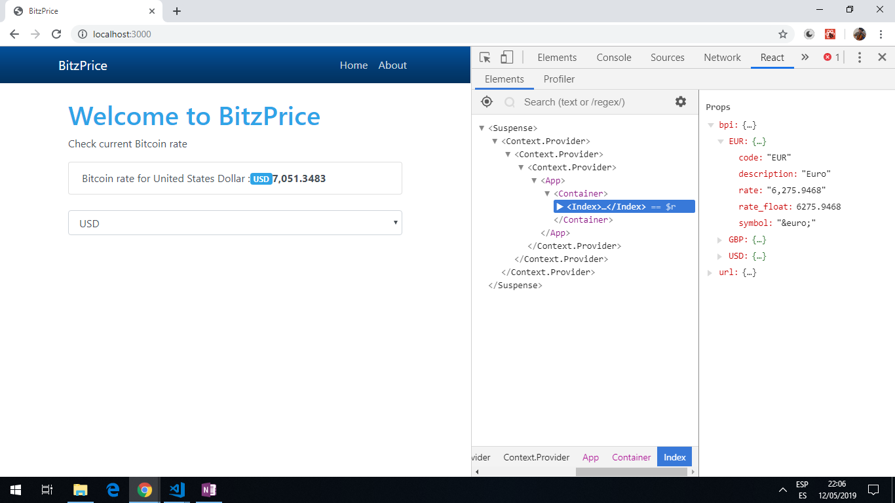

# :zap: React Next API

* Creates a Bitcoin currency price api app using React and Next.js. npm dependencies updated.
* **Note:** to open web links in a new window use: _ctrl+click on link_


## :page_facing_up: Table of contents

* [General info](#general-info)
* [Screenshots](#screenshots)
* [Technologies](#technologies)
* [Setup](#setup)
* [Features](#features)
* [Status](#status)
* [Inspiration](#inspiration)
* [Contact](#contact)

## :books: General info

* Lists prices of cryptocurrencies, depending on setup of API http request.
* Next.js is for server-rendered react apps. It has automatic code splitting, simple page-based routing, built-in CSS support and hot reloading.

## :camera: Screenshots

.

## :signal_strength: Technologies

* [Node.js v12](https://nodejs.org/) javascript runtime using the [Chrome V8 engine](https://v8.dev/).
* [React v16](https://reactjs.org/) Javascript library.
* [Next v9](https://nextjs.org/) minimalist framework for rendering react apps on the server.

## :floppy_disk: Setup

* `npm run dev` runs the app in the development mode. Open [http://localhost:3000](http://localhost:3000) to view it in the browser.
* `npm run build` Builds the app for production to the `build` folder. It correctly bundles React in production mode and optimizes the build for the best performance. The build is minified and the filenames include the hashes.

## :computer: Code Examples

* extract of `index.js` - function to get API data.

```javascript

// async await function to get crypto currency prices - no API key required.
Index.getInitialProps = async function() {
  const res = await fetch
  ('https://api.coindesk.com/v1/bpi/currentprice.json');
    const data = await res.json();

  return {
    bpi: data.bpi
  };
}

```

## :clipboard: Status & To-Do List

* Status: Working.
* To-Do: nothing.

## :clap: Inspiration

* [Traversy Media: Next.js Crash Course - Server Side React](https://www.youtube.com/watch?v=IkOVe40Sy0U&t=1s)
* [CoinDesk Bitcoin Price Index API](https://www.coindesk.com/api)

## :file_folder: License

* N/A

## :envelope: Contact

* Repo created by [ABateman](https://github.com/AndrewJBateman), email: gomezbateman@yahoo.com
